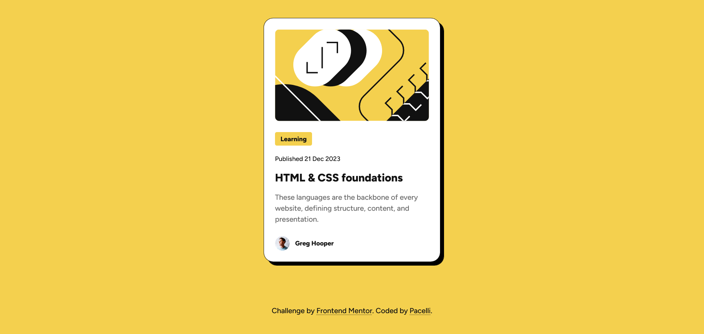

# Frontend Mentor - Blog preview card solution

This is a solution to the [Blog preview card challenge on Frontend Mentor](https://www.frontendmentor.io/challenges/blog-preview-card-ckPaj01IcS). Frontend Mentor challenges help you improve your coding skills by building realistic projects.

## Table of contents

- [Getting Started](#getting-started)
- [Overview](#overview)
    - [The challenge](#the-challenge)
    - [Screenshot](#screenshot)
    - [Links](#links)
- [My process](#my-process)
    - [Built with](#built-with)
    - [What I learned](#what-i-learned)
    - [Useful resources](#useful-resources)
    - [AI Collaboration](#ai-collaboration)
- [Author](#author)

## Getting started

Clone the repo and install the dependencies:

```bash
git clone git@github.com:pacelli3/frontend-mentor-challenges.git
cd frontend-mentor-challenges/blog-preview-card
npm install
```

Start Vite's dev server:

```bash
npm run dev
```

This project uses [Prettier](https://prettier.io/docs/) for code formatting:

```bash
npm run prettier:fix # Format files
npm run prettier:check # List unformatted files
```

## Overview

### The challenge

Users should be able to:

1. See the resizing of the card when decreasing or increasing the width of the window.
2. See the hover state when hovering over the card &mdash; the color of the title of the card should change

### Screenshot



### Links

- Solution URL: [Add solution URL here](https://your-solution-url.com)
- Live Site URL: [Add live site URL here](https://your-live-site-url.com)

## My process

### Built with

- Semantic HTML5 markup
- CSS custom properties
- CSS utility classes
- Flexbox
- CSS Grid
- [Vite](https://vite.dev/) - To build and develop the project

### What I learned

#### Layout and styling

This is a small and simple project consisting of building a blog preview card.

The styling and layout is in my opinion the easiest part of this project, because we can group the entire content of the card in a container and set the layout to a single column where each element will stack on top of each other. This can be easily achieved using Flexbox or CSS Grid.

Imagine this is the markup:

```html
<div class="container">
    
    <p>Learning</p>
    <p>Published 21 Dec 2023</p>
    <h1>HTML & CSS foundations</h1>
    <p>
        These languages are the backbone of every website, defining structure, content, and
        presentation.
    </p>

    <div>
        
        <p>Greg Hooper</p>
    </div>
</div>
```

Single column with Flexbox:

```css
.container {
    display: flex;
    flex-direction: column; /* This aligns everything in a single column  */
}
```

Single column with CSS Grid:

```css
.container {
    display: grid; /* Display of grid automatically aligns everything in a single column  */
}
```

After having the correct layout we can apply the styling &mdash; colors, spacing, font sizes, font family, gap, padding, margins, etc.

#### Semantic HTML

Using a `<div>` as the container, its convenient because it help us to group content and apply the styling, but a `<div>` is a generic container that does not convey meaningful meaning or purpose about of its content and should only be used when:

1. There is no other semantic element that is appropiate
2. Group elements to facilitate styling

We could replace the `<div>` with a `<section>` or a `<main>`, but the same problem remains &mdash; these elements are not semantically correct.

Next I will explain what are, in my opinion, the correct HTML elements for each of the children in the card:

#### Container

This should be an `<article>` element, from the HTML Standard:

> The article element represents a complete, or self-contained, composition in a document, page, application, or site and that is, in principle, independently distributable or reusable, e.g. in syndication. This could be a forum post, a magazine or newspaper article, a blog entry, a user-submitted comment, an interactive widget or gadget, or any other independent item of content.

I don't fully understand what all of this means, but what I understood is: whatever we put inside an `<article>` it has to make sense without context and thankfully the purpose of the card is listed as one of the examples in the definition.

A `<section>` will not work either because this is another type of generic container that should not be used when an `<article>` makes sense.

#### Post banner

Using an `` is the only choice because this represents an illustration and its meaning is not necessarily derived from the content, we only need to add the `alt` attribute.

#### Badge

This is used to indicate the category of the post, here I used a `<span>` element because is more of a decorative indicator, rather than part of the content.

#### Date

Here I use a nested `<time>` element, with its `datetime` attribute, inside inside a `<p>` element.

#### Title

`<article>` elements should always contain a heading. I used an `<h1>`, because the card in the only content in the app, but in a real-app we should use a smaller heading, e.g. a `<h2>` or `<h3>`.

#### Description

Here I used a `<p>` element. This is a straightforward choice.

#### Author information

At the beginning I was tempted to use an `<address>` element but this should be used to display **contact information** of the author, but here we need to display the name and an avatar, therefore I decided to use a `<figure>` and a `<figcaption>` elements.

The final markup is in [`index.html`](./index.html).

### Useful resources

I used the following resources to dive deeper into certain HTML elements to understand their usage and capabilities:

- [`<article>` HTML article contents element](https://developer.mozilla.org/en-US/docs/Web/HTML/Reference/Elements/article)
- [`<address>` HTML contact address element](https://developer.mozilla.org/en-US/docs/Web/HTML/Reference/Elements/address)
- [`<div>` HTML content division element](https://developer.mozilla.org/en-US/docs/Web/HTML/Reference/Elements/div)
- [`<section>` HTML generic section element](https://developer.mozilla.org/en-US/docs/Web/HTML/Reference/Elements/section)
- [The article element](https://html.spec.whatwg.org/multipage/sections.html#the-article-element) - Link to the HTML specification

### AI Collaboration

I used DeepSeek to brainstorm a solution to determine how make the `<article>` a link. Typically, cards act as previews to the actual content and clicking on them will redirect us to the content.

At the beginning I thought of wrapping the entire article inside anchor tags, but DeepSeek explained to me this would end up affecting the accesibility of the card, because the entire content will be read to users that rely on assistive technologies.

Assume this is the card markup:

```html
<a href="#">
    <article class="container">
        
        <span>Learning</span>
        <p>Published 21 Dec 2023</p>
        <h1>HTML & CSS foundations</h1>
        <p>
            These languages are the backbone of every website, defining structure, content, and
            presentation.
        </p>

        <figure>
            
            <figcaption>Greg Hooper</figcaption>
        </figure>
    </article>
</a>
```

The screen reader will read to the user:

> blog card image. Learning Published 21 Dec 2023 HTML & CSS foundations These languages are the backbone of every website, defining structure, content, and presentation. Photo of the author: Greg Hooper. Greg Hooper

Which does not makes any sense.

Instead, is better to use a "Stretched Link":

1. Remove the anchor tag that is wrapping the article
2. Nest an anchor tag inside the title of the card
3. Apply styling to enlarge the surface of the anchor tag to cover the entire surface of the cards

```html
<h1>
    <a href="#">HTML & CSS foundations</a>
</h1>
```

```css
article {
    position: relative;
    /* The rest of the styles... */
}

article a::after {
    content: "";
    position: absolute;
    inset: 0; /* The magic is here: this makes it cover the entire surface of the card (drop-shadow excluded) */
}
```

With these changes "HTML & CSS foundations" is what will be read to the user.

## Author

- Frontend Mentor - [@pacelli3](https://www.frontendmentor.io/profile/pacelli3)
