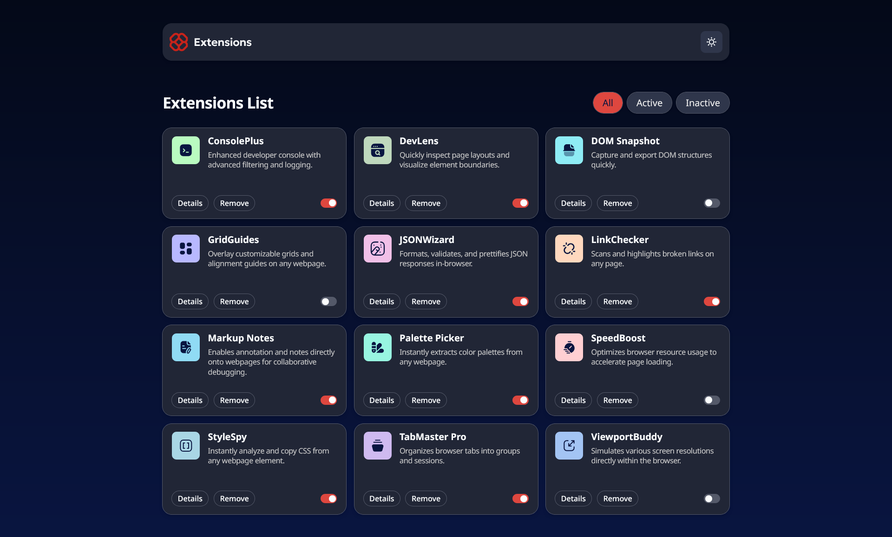
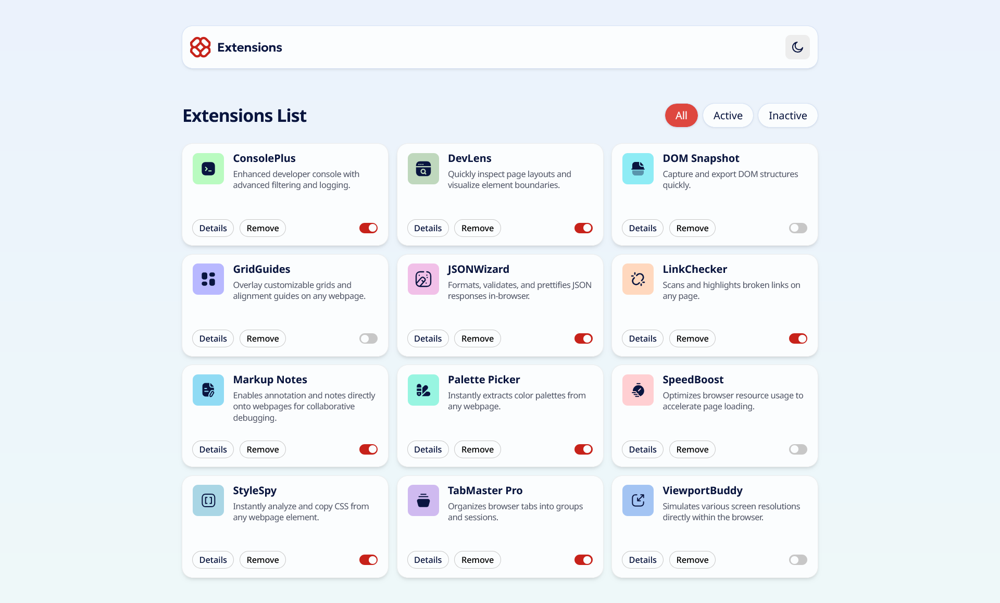

# Frontend Mentor - Browser extensions manager UI solution

This is a solution to the [Browser extensions manager UI challenge on Frontend Mentor](https://www.frontendmentor.io/challenges/browser-extension-manager-ui-yNZnOfsMAp). Frontend Mentor challenges help you improve your coding skills by building realistic projects.

## Table of contents

- [Getting Started](#getting-started)
- [Overview](#overview)
    - [The challenge](#the-challenge)
    - [Screenshot](#screenshot)
    - [Links](#links)
- [My process](#my-process)
    - [Built with](#built-with)
    - [What I learned](#what-i-learned)
    - [Continued development](#continued-development)
    - [Useful resources](#useful-resources)
- [Author](#author)
- [Acknowledgments](#acknowledgments)
- [License](#license)

## Getting started

Clone the repo and install the dependencies:

```bash
git clone git@github.com:pacelli3/frontend-mentor-challenges.git
cd frontend-mentor-challenges/browser-extension-manager-ui
npm install
```

Start React Router's dev server (Netlify is integrated):

```bash
npm run dev
```

Build the project and serve locally:

```bash
npm run build
npm run start
```

This project uses Prettier for code formatting:

```bash
npm run prettier:fix # Format files
npm run prettier:check # List unformatted files
```

## Overview

### The challenge

Your challenge is to build out this browser extension manager UI and get it looking as close to the design as possible.

You can use any tools you like to help you complete the challenge. So if you've got something you'd like to practice, feel free to give it a go.

We provide the data for the extensions in a local `data.json` file. So you can use that to add the data dynamically if you choose.

Your users should be able to:

- Toggle extensions between active and inactive states
- Filter active and inactive extensions
- Remove extensions from the list
- Select their color theme
- View the optimal layout for the interface depending on their device's screen size
- See hover and focus states for all interactive elements on the page

### Screenshot

| Dark Mode                                                                                       | Light                                                                                            |
| ----------------------------------------------------------------------------------------------- | ------------------------------------------------------------------------------------------------ |
|  |  |

### Links

- Solution URL: [Check](https://www.frontendmentor.io/solutions/browser-extension-manager-with-supabase-react-router-v7-and-tailwindcss-13FF5EXJe4)
- Live Site URL: [Check](https://browser-extension-manager-pacelli3.netlify.app/)

## My process

### Built with

- Semantic HTML5 markup
- Tailwind CSS
- Flexbox
- CSS Grid
- React Router v7
- Vite - To build and develop the project
- PerfectPixel by WellDoneCode (pixel perfect) - useful for those who don't have figma files
- Netlify - hosting platform
- TypeScript
- clsx - to construct `className` string conditionally
- Supabase - to create database of extensions data
- Prettier - code formatting
- uuid - to create robust unique id for extension data

### What I learned

#### React Router

React Router is a multi-strategy router for React apps. The current version of the framework is 7 and it was merged with the Remix framework.

React Router can be used in three modes each with different architecture and set of features:

- Framework: wraps Data mode with a Vite plugin
- Data: adds data loading, actions, pending states and more with APIs
- Declarative: enables basic routing features

> :memo: **Note:** I decided to use Framework mode because is the recommended mode for people who are starting with the framework.

In v7 a React Router project is composed of 4 files:

```text
├── app/
│   ├── root.jsx
│   └── routes.js
├── package.json
└── vite.config.js
```

React Router uses Vite underhood, it's required to provide a Vite configuration file (preferrably using TypeScript) with the React Router Vite plugin. This is the basic configuration:

```ts
// vite.config.ts

import {defineConfig} from "vite";
import {reactRouter} from "@react-router/dev/vite";

export default defineConfig({
    plugins: [reactRouter()],
});
```

React Router keeps track of change in the `app/` directory and it's where application-logic should be included.

`app/root.tsx` is the _Root Route_. It's the root layout of your entire app. Here's the basic set of elements you'll need for any project:

```tsx
// app/root.tsx

import { Outlet, Scripts } from "react-router";

export default function App() {
  return (
    <html>
      <head>
        <link
          rel="icon"
          href="data:image/x-icon;base64,AA"
        />
      </head>
      <body>
        <h1>Hello world!</h1>
        <Outlet />
        <Scripts />
      </body>
    </html>
  );
}
```

`app/routes.ts` is where routes are defined. The existence of `routes.ts` is required to build a React Router app and it must export a empty array as the bare minimum.

```ts
// empty app/routes.ts

export default [];
```

```ts
// empty app/routes.ts

import {index, route, type RouteConfig} from "@react-router/dev/routes";

export default [
    index("routes/home.tsx"),
    route("about", "routes/about.tsx"),
    route("contact", "routes/contact.tsx"),
    route("*", "routes/not-found.tsx"),
] satisfies RouteConfig;
```

Routes are defined in `app/routes/`.

When working in Framework mode, React Router fits into the "Backend for Frontend" architecture.

The BFF strategy employs a web server with a job scoped to serving the frontend web app and connecting it to the services it needs: your database, mailer, job queues, existing backend APIs (REST, GraphQL), etc. Instead of your UI integrating directly from the browser to these services, it connects to the BFF, and the BFF connects to your services.

It's possible to use `fetch` in loaders and actions to interact with the backend:

```tsx
// app/routes/home.tsx

// `Route` includes type scoped for this route, auto-generated by React Router
import type {Route} from "./+types/home";

export const loader = async() => {
  const apiUrl = "https://api.example.com/some-data.json";
  const res = await fetch(apiUrl, {
    headers: {
      Authorization: `Bearer ${process.env.API_TOKEN}`,
    },
  });

  const data = await res.json();
  return { data };
}

// `loaderData` is automatically provided as props to the component with the correct type.
const Home = ({loaderData}: Route.ComponentProps) => {
    // omitted for brevity
}

export default Home;
```

React Router offers more features to build fullstack applications.

#### Tailwind CSS

Tailwind is a utility-first CSS framework packed with classes like `flex`, `pt-4`, `text-center` and `rotate-90` that can be composed to build any design, directly in your markup. It works by scanning all of the HTML files, JavaScript components, and any other templates for class names, generating the corresponding styles and then writing them into a static CSS file.

When I started doing challenges from Frontend Mentor, I realized that writing Utility Classes become second nature&mdash;they control 1 thing and we can reuse them wherever we want. If we pair them with Custom Property we have a powerful and dynamic pattern to write CSS modules.

There are still a few issues with writing CSS modules are:

- Specificity: CSS rules have different weights and can override previous rules
- Naming: if the application get big, coming up with hundreds of unique names can become a difficult challenge even with methodologies like BEM
- Markup and styles are in different modules: we need to constantly switch files

There are CSS-in-JS libraries that allows to write styles in scripts, but each may have different downsides, e.g. Runtime CSS-in-JS increase browser overhead and Compile-Time CSS-in-JS requires bundler integration.

I agree that Tailwind can make the application verbose and getting fluent by learning the utility classes can take time, but I really the idea of not naming CSS rules and not switching files.

#### Supabase

Supabase is a Postgres development platform that bundles a lot of backend functionality out of the box &mdash; database, auth, Storage, realtime subscriptions, and serverless functions.

For this project I used Supabase's Database and Storage services to:

- serve the extensions' SVG logos
- create a table with all the extension data, which can be queried and updated

I was surprised how easy is to use Supabase. Once a account is created we can follow one of the Framework Quickstarts to create a Supabase project, create an app using a template, install a Supabase client library and connect to the app.

### Continued development

- Refactor hacky approach in `app/contexts/ThemeProvider` from `React.useEffect` to a cookie to fetch selected theme on the server
- Work on accessibility:
    - add skip to content button
    - add ARIA attributes
    - add ARIA live regions
    - test with a screen reader
    - working on animating transations when a filter is applied
- Testing:
    - use React Router's `createRoutesStub` function to test components
    - integrate Mock Service Worker for API mocking
    - integrate Vitest to write unit tests for components
- Extra routes:
    - add a `/details/:extensionId` route, to render detail about each extension, route (this route will need a banner, get it from official app)
- Error handling
    - currently, the app contains a single `ErrorBoundary` component, add boundaries on each route
    - mock error responses
- Interactivity
    - add a script to toggle the extension's `is_active` property when toggle button is clicked (consider using a fetcher or `Form` component)

### Useful resources

I used the following resources to help me with this design:

- [NVDA](https://www.nvaccess.org/)
- [React Router](https://reactrouter.com/home)
- [BEM](https://getbem.com/)
- [Prettier](https://prettier.io/docs/)
- [Vite](https://vite.dev/)
- [PerfectPixel by WellDoneCode (pixel perfect)](https://www.welldonecode.com/perfectpixel/)
- [Netlify File-based configuration](https://docs.netlify.com/build/configure-builds/file-based-configuration/)
- [React Router on Netlify](https://docs.netlify.com/build/frameworks/framework-setup-guides/react-router/)
- [clsx](https://github.com/lukeed/clsx)
- [uuid](https://github.com/uuidjs/uuid)
- [TypeScript Documentation](https://www.typescriptlang.org/docs/)
- [Get started with Tailwind CSS](https://tailwindcss.com/docs/installation/using-vite)
- [React Router: Testing](https://reactrouter.com/start/framework/testing)
- [React Router: Framework Mode](https://reactrouter.com/start/framework/installation)
- [React Router Tutorial: Address Book](https://reactrouter.com/tutorials/address-book)
- [Mock Service Worker](https://mswjs.io/docs/)
- [Vitest](https://vitest.dev/)
- [Use Supabase with React](https://supabase.com/docs/guides/getting-started/quickstarts/reactjs)

## Author

- Frontend Mentor - [@pacelli3](https://www.frontendmentor.io/profile/pacelli3)

## Acknowledgments

I closely followed Frontend Mentor's 404 page to design the catchall route of the app.

## License

This project is licensed under the [MIT License](../LICENSE).
