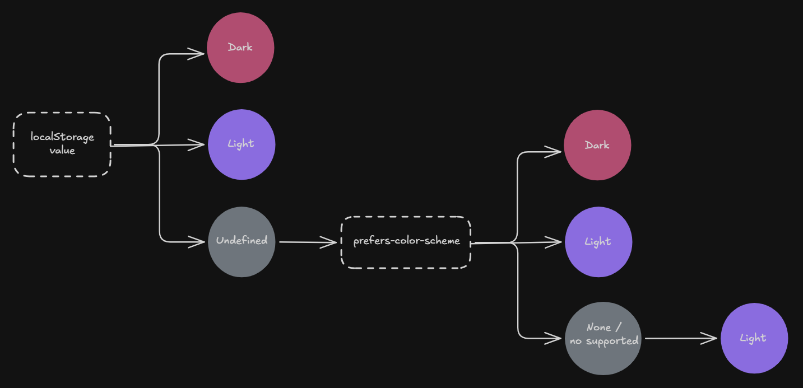

# Dark Mode

This feature was more difficult than expected and the implementation greatly depends on the framework and rendering strategy.

To achieve the best possible UX, a dark mode feature should meet the following requirements:

- the user should be able to click on a toggle button to change the theme
- the user's preference should be cached for future renders
- the theme should default to the preferred color scheme, according to the operating system setting. If not set, it should default to the light mode
- the webpage should not flicker on the initial render, even if the user has not set a preferred scheme on the aplication or on the operating system

## Flow

The execution flow to determine the theme for the initial render can be charted as such:

<p align="center">
    
</p>

## Initial Implementation

My first implementation of dark mode was with the following `ThemeProvider`:

```tsx
type Theme = "dark" | "light";

interface ThemeContext {
    theme: Theme;
    toggleTheme: () => void;
}

export const ThemeContext = createContext<ThemeContext | undefined>(undefined);

export const ThemeProvider = ({children}: {children: ReactNode}) => {
    const [theme, setTheme] = useState<Theme>("light");

    useEffect(() => {
        const storedTheme = localStorage.getItem("extensions-theme") as Theme;

        if (storedTheme) {
            setTheme(storedTheme);
        }
    }, []);

    useEffect(() => {
        const root = document.documentElement;

        if (theme === "light") {
            root.classList.remove("dark");
        } else {
            root.classList.add("dark");
        }

        localStorage.setItem("extensions-theme", theme);
    }, [theme]);

    const toggleTheme = () => setTheme(prev => (prev === "light" ? "dark" : "light"));

    return <ThemeContext.Provider value={{theme, toggleTheme}}>{children}</ThemeContext.Provider>;
};
```

`ThemeProvider` uses React context to easily distribute the current theme to the entire application, and to update and keep it in sync with `window.localStorage`.

On the initial render, the `theme` state defaults to the `light` mode. Then, the first `React.useEffect` hook runs, after the components are mounted, to query `localStorage` for the user preference, if found, `theme` is updated with the value, trigerring a re-render. Now, the second `useEffect` hooks runs to: add or remove the `dark` class on the `<html>` and update `localStorage`.

The them can be toggled using the `toggleTheme` event handler, when executed, the second `useEffect` will re-run.

This implementation has a few problems:

1. Light mode is always used for the initial render. The user preference is fetched inside a `useEffect` hook, which only runs on the client after everything is painted on the screen, this project uses Server-Side Rendering, there is no way to access the user's preference in advance when the webpage is built on the server
2. Ignores the `prefers-color-scheme` CSS media feature
3. Unnecessary renders: on initial render if the `useEffect` detects a saved preference `theme` is updated, which will trigger the second `useEffect` to run and set `theme` again

## Refactoring

The app needs to know the user preference in advance, either on the server or before is mounted.

The server could access the saved theme with a cookie &mdash; cookies are sent to a server on each HTTP request and are easy to implement. The problem of using a cookie for the dark mode feature is the frequent transmit of the theme over HTTP, which can impact performance. Additionally, is better to restrict the use of a cookie for more important information, e.g. for credentials to validate authentication. For non-essential information, e.g. UI preferences, is better to use `localStorage`.

React offers the `dangerouslySetInnerHTML` property to use on JSX elements to programatically set their content. With this property, we can inject a `<script>` element with logic to determine the theme for the initial render.

```tsx
<body>
    <script
        dangerouslySetInnerHTML={{
            __html: `
            (function() {
                function getInitialTheme() {
                    const persistedTheme = window.localStorage.getItem("extensions-theme");
                    const hasPersistedTheme = typeof persistedTheme === "string";

                    if (hasPersistedTheme) return persistedTheme;

                    const mediaQueryPreference = window.matchMedia("(prefers-color-scheme: dark)");
                    const hasMediaQueryPreference = typeof mediaQueryPreference.matches === "boolean";

                    if (hasMediaQueryPreference) {
                        return mediaQueryPreference.matches ? "dark" : "light";
                    }

                    return "light";
                }

                const theme = getInitialTheme();
                const root = document.documentElement;

                if(theme === "dark") {
                    root.classList.add("dark");
                } else {
                    root.classList.remove("dark");
                }
            })();
        `,
        }}
    ></script>

    {/* The rest of the `<body>`, e.g. React children... */}
</body>
```

`dangerouslySetInnerHTML` receives an object with a single `__html` property set to any raw HTML string.

> [!WARNING]
> Using `dangerouslySetInnerHTML` is dangerous. As with the underlying DOM `innerHTML` property, because is trivial to introduce a XSS vulnerability if the markup, to inject, is not coming from a completely trusted source.

The `<script>` element has a synchronous nature and if put as the first child of the `<body>` **we can block the parsing of the document received by the browser until it has determined which is the initial theme**. The `__html` property receives a function with the following logic:

1. first, query `localStorage` for the cached theme: if found it's returned, otherwise the execution continues
2. check if the `prefers-color-scheme` is set on the operating system, if found returns the corresponding class
3. if none of the above hits, the `light` mode is returned as the default
4. once the initial theme is determined, the `dark` class is applied or removed from the `<html>` element

Now, for the the initial render the app will be painted with the correct theme and without flicker.

## Finishing the implementation

To complete the dark mode feature we need to provide the logic to: toggle the theme and when `localStorage` is updated.

`ThemeProvider` can be refactor as such:

```tsx
type Theme = "dark" | "light" | undefined;

interface ThemeContext {
    theme: Theme;
    toggle: (theme: Theme) => void;
}

export const ThemeContext = createContext<ThemeContext | undefined>(undefined);

export const ThemeProvider = ({children}: {children: ReactNode}) => {
    const [theme, setTheme] = useState<Theme>(undefined);

    useEffect(() => {
        const root = document.documentElement;

        if (root.classList.contains("dark")) {
            setTheme("dark");
        } else {
            setTheme("light");
        }
    }, []);

    const toggle = (theme: Theme) => {
        setTheme(theme);
        window.localStorage.setItem("extensions-theme", theme!);

        const root = window.document.documentElement;

        if (theme === "dark") {
            root.classList.add("dark");
        } else {
            root.classList.remove("dark");
        }
    };

    return <ThemeContext.Provider value={{theme, toggle}}>{children}</ThemeContext.Provider>;
};
```

`ThemeProvider` no longer has the responsibility to query `localStorage` and to set the value of `theme`, instead in a single `useEffect` hook, it directly checks if the `<html>` element has the `dark` class applied to it, and updates `theme` depending on the result. This is still necessary for conditional rendering across the app.

The logic to toggle the theme and update `localStorage` is aggregated in a single `toggle` event handler.
