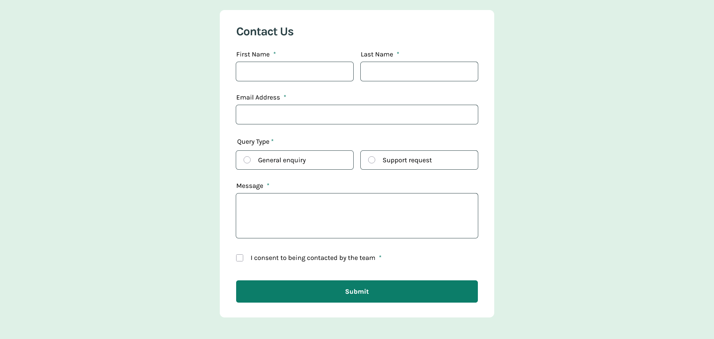

# Frontend Mentor - Contact form solution

This is a solution to the [Contact form challenge on Frontend Mentor](https://www.frontendmentor.io/challenges/contact-form--G-hYlqKJj). Frontend Mentor challenges help you improve your coding skills by building realistic projects.

## Table of contents

- [Getting Started](#getting-started)
- [Overview](#overview)
    - [The challenge](#the-challenge)
    - [Screenshot](#screenshot)
    - [Links](#links)
- [My process](#my-process)
    - [Built with](#built-with)
    - [What I learned](#what-i-learned)
    - [Useful resources](#useful-resources)
    - [AI Collaboration](#ai-collaboration)
- [Author](#author)
- [License](#license)

## Getting started

Clone the repo and install the dependencies:

```bash
git clone git@github.com:pacelli3/frontend-mentor-challenges.git
cd frontend-mentor-challenges/contact-form
npm install
```

Start Vite's dev server:

```bash
npm run dev
```

This project uses Prettier for code formatting:

```bash
npm run prettier:fix # Format files
npm run prettier:check # List unformatted files
```

## Overview

### The challenge

Your challenge is to build out this contact form and get it looking as close to the design as possible. Pay particular attention to making this form accessible. Building accessible forms is a key skill for front-end developers. So this is a perfect challenge to practice.

You can use any tools you like to help you complete the challenge. So if you've got something you'd like to practice, feel free to give it a go.

Your users should be able to:

- Complete the form and see a success toast message upon successful submission
- Receive form validation messages if:
    - A required field has been missed
    - The email address is not formatted correctly
- Complete the form only using their keyboard
- Have inputs, error messages, and the success message announced on their screen reader
- View the optimal layout for the interface depending on their device's screen size
- See hover and focus states for all interactive elements on the page

### Screenshot



### Links

- Solution URL: [Check](https://www.frontendmentor.io/solutions/responsive-and-accessible-contact-form-with-html-css-and-typescript-M3ZQyKaJrr)
- Live Site URL: [Check](https://contact-form-pacelli3.netlify.app/)

## My process

### Built with

- Semantic HTML5 markup
- CSS custom properties
- CSS utility classes
- Flexbox
- BEM - naming methodology for class names
- Vite - To build and develop the project
- PerfectPixel by WellDoneCode (pixel perfect) - useful for those who don't have figma files
- NVDA - powerful screen reader

### What I learned

#### Forms

The `<form>` element represents a section or piece of UI with interactive controls to allow users to submit information. Forms are typically used for registration, commenting, purchasing services, etc.

For the controls we can use element like `<input>`, `<textarea>`. For the `<input>`, element HTML offers a comprehensive list of different types to choose according to the type of data it should receive, e.g. email, date, number, text, checkbox, radio; and according to their type they perform specific validation on the data. Validation can be extended or customized by using other attributes, e.g. `min`, for the permitted minimum length; `max` for the permitted maximum length; `src` for specify paths, `alt` for images, `height`, `width`, etc.

#### Labeling controls

Labeling form controls is important because it facilitates indentification and can convey purpose for all users, no control should be left without its label. There are two patterns to label them: explicit and implicit.

To explicitly label a control use the `for` attribute of the `<label>` element and match it to the value of the `id` attribute of the control. This is the best method because is the most supported by assistive technologies.

```html
<label for="firstname">First name:</label>
<input type="text" name="firstname" id="firstname" /><br />

<input type="checkbox" name="subscribe" id="subscribe" />
<label for="subscribe">Subscribe to newsletter</label>
```

It's also possible to explicitly label a controls using the `aria-label` and `aria-describedby` attribute, these methods are widely supported by assistive technologies, but the lack of a visual indicator makes them only useful for users that rely on assistive technologies

We can also use `title` attribute, but this method is the less reliable because many screen readers will not interpret this attribute as the replacement for a `<label>`. It can be used to stored less important data to be consumed elsewhere.

To implicitly label a form we need to use the `<label>` element as the parent of the control, in this method the `for` attribute is not needed:

```html
<label>
    <input type="radio" />
    <span>General enquiry</span>
</label>
```

Wherenever possible an explicitly label should be used.

#### Grouping content

Grouping related controls can facilitate the understanding of the form and enhance navigation by allowing to focus on smaller groups.

The `<fieldset>` element acts as the container and the `<legend>` element acts as the heading of the group. Common used cases of these elements is to group radio buttons, checkboxes and other related fields, e.g. a shipping address.

```html
<fieldset>
    <legend>Choose your favorite monster</legend>

    <input type="radio" id="kraken" name="monster" value="K" />
    <label for="kraken">Kraken</label><br />

    <input type="radio" id="sasquatch" name="monster" value="S" />
    <label for="sasquatch">Sasquatch</label><br />

    <input type="radio" id="mothman" name="monster" value="M" />
    <label for="mothman">Mothman</label>
</fieldset>
```

#### Validation

Form validation of user inputs is important because it reduces the possibility of errors. HTML5 defines a wide range of built-in functionality to validate common input types, e.g. date and email. Instructions can be provided to further help the users to complete the form.

Browsers provide default validation for forms when they are submitted, but in many cases providing custom validation can be better because gives complete control over how and when a form is validated. To disable the browser default validation we need to add the `novalidate` attribute on the `<form>` element.

Validation can be triggered at many stages:

- Before users has anwered any field, this might be useful for questions where users may need assistance
- While the users is answering, this could happen on each keystroke or immediately after the users has answered a questions and moved to the next.
- After the user submitted a form

I think that validating before and on each keystroke sound distracting and could lead to frutration. In my opinion validation should occur when:

1.  After an user answered a question and moved to the next one, we can add an event listener to the control element to listen for the `blur` event and check if the `:user-invalid` pseudo class is applied
2.  After submission, we can add an event listern to the form to listen for the `submit` event and collect all the elements with the `:invalid` pseudo class using the `document.querySelectorAll()` method

Lastly, the `required` attribute makes it so that a form cannot be submitted if a control with this attribute is not answered. Browsers that support this attribute will include a `aria-required="true"` to the control, is possible a browsers does not do this by default.

#### ARIA live regions

To notify to the user of feedback like errors and success upon submitting the form it's necessary to use ARIA live regions. These elments are used to dynamically change parts of the document without the need of reloading the full page. ARIA live regions are good to display visual changes, but they also ensure that users of assistive technologies are aware of them.

In this project ARIA live regions are used in the following situations:

- When an user answers a field, it does not pass the validation test and a `blur` event is emitted: an ARIA live region with `role="alert"` is used to **immediately** notify the user of the error. Setting `role="alert"` is equivalent to setting `aria-live="assertive"` and `aria-atomic="true"`.
- When an user submits the form, it passed the validity check and a `submit` event is emitted: an ARIA live region with `role="status"` is used to **eventually** notifiy the user of the success. Setting `role="status"` is equivalent to setting `aria-live="polite"` and `aria-atomic="true"`.

#### Making forms accessible

This involves:

1. Picking the appropiate HTML elements with its attributes
2. Labeling controls
3. Grouping related content
4. Providing instructions when needed
5. Validing the form on the appropiate time
6. Providing feedback &mdash; on success, error and submission
7. Manipulating styling for the distincts states &mdash; e.g. colors, display of the elements

### Useful resources

I used the following resources to help me with this design:

- [NVDA](https://www.nvaccess.org/)
- [BEM](https://getbem.com/)
- [Prettier](https://prettier.io/docs/)
- [Vite](https://vite.dev/)
- [PerfectPixel by WellDoneCode (pixel perfect)](https://www.welldonecode.com/perfectpixel/)
- [ARIA: alert role](https://developer.mozilla.org/en-US/docs/Web/Accessibility/ARIA/Reference/Roles/alert_role)
- [ARIA: status role](https://developer.mozilla.org/en-US/docs/Web/Accessibility/ARIA/Reference/Roles/status_role)
- [The Complete Guide to ARIA Live Regions for Developers](https://www.a11y-collective.com/blog/aria-live/)
- [How to design accessible forms in 10 steps](https://blog.methods.co.uk/en/all-insights/how-to-design-accessible-forms-in-10-steps)
- [ARIA live regions](https://developer.mozilla.org/en-US/docs/Web/Accessibility/ARIA/Guides/Live_regions)
- [Testing ARIA-LIVE](https://www.davidmacd.com/blog/test-aria-live-display-none.html)
- [Forms Tutorial](https://www.w3.org/WAI/tutorials/forms/)
- [`:focus-within` CSS pseudo-class](https://developer.mozilla.org/en-US/docs/Web/CSS/Reference/Selectors/:focus-within)
- [`:user-invalid` CSS pseudo-class](https://developer.mozilla.org/en-US/docs/Web/CSS/Reference/Selectors/:user-invalid)
- [`<form>` HTML form element](https://developer.mozilla.org/en-US/docs/Web/HTML/Reference/Elements/form)
- [`<input>` HTML input element](https://developer.mozilla.org/en-US/docs/Web/HTML/Reference/Elements/input)
- [`<textarea>` HTML textarea element](https://developer.mozilla.org/en-US/docs/Web/HTML/Reference/Elements/textarea)
- [`<label>` HTML label element](https://developer.mozilla.org/en-US/docs/Web/HTML/Reference/Elements/label)
- [`<fieldset>` HTML field set element](https://developer.mozilla.org/en-US/docs/Web/HTML/Reference/Elements/fieldset)
- [Element: blur event](https://developer.mozilla.org/en-US/docs/Web/API/Element/blur_event)
- [HTMLFormElement: submit event](https://developer.mozilla.org/en-US/docs/Web/API/HTMLFormElement/submit_event)
- [Form validation - When should error messages be triggered?](https://ux.stackexchange.com/a/74541)
- [Toasts are Bad UX](https://maxschmitt.me/posts/toasts-bad-ux)

### AI Collaboration

This challenge involved a lot of reading and understanding many new concepts, without the help from DeepSeek I would have struggle a lot more to define a strategy to create the form, specially to decide when to execute validation.

## Author

- Frontend Mentor - [@pacelli3](https://www.frontendmentor.io/profile/pacelli3)

## License

This project is licensed under the [MIT License](../LICENSE).
