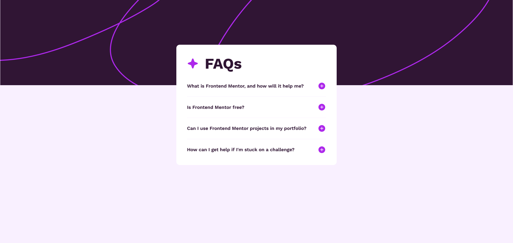

# Frontend Mentor - FAQ accordion solution

This is a solution to the [FAQ accordion challenge on Frontend Mentor](https://www.frontendmentor.io/challenges/faq-accordion-wyfFdeBwBz). Frontend Mentor challenges help you improve your coding skills by building realistic projects.

## Table of contents

- [Getting Started](#getting-started)
- [Overview](#overview)
    - [The challenge](#the-challenge)
    - [Screenshot](#screenshot)
    - [Links](#links)
- [My process](#my-process)
    - [Built with](#built-with)
    - [What I learned](#what-i-learned)
    - [Useful resources](#useful-resources)
- [Author](#author)
- [License](#license)

## Getting started

Clone the repo and install the dependencies:

```bash
git clone git@github.com:pacelli3/frontend-mentor-challenges.git
cd frontend-mentor-challenges/faq-accordion
npm install
```

Start Vite's dev server:

```bash
npm run dev
```

This project uses Prettier for code formatting:

```bash
npm run prettier:fix # Format files
npm run prettier:check # List unformatted files
```

## Overview

### The challenge

Users should be able to:

- Hide/Show the answer to a question when the question is clicked
- Navigate the questions and hide/show answers using keyboard navigation alone
- View the optimal layout for the interface depending on their device's screen size
- See hover and focus states for all interactive elements on the page

### Screenshot



### Links

- Solution URL: [Check]()
- Live Site URL: [Check]()

## My process

### Built with

- Semantic HTML5 markup
- CSS custom properties
- CSS utility classes
- Flexbox
- CSS Grid
- BEM - naming methodology for class names
- Vite - To build and develop the project
- PerfectPixel by WellDoneCode (pixel perfect) - useful for those who don't have figma files
- NVDA - powerful screen reader

### What I learned

An accordion is a useful component to control how the content of a webpage is presented, visitors does not need to see every piece of information on a site so it's important to determine which information needs to be visible.

An accordion is a component with collapsible sections &mdash; it reduces clutter on the document, facilitates navigation and make it easier to find information. By organizing content in collapsible sections, accordions also reduce the cognitive load to undertand the page and smooth the user experience.

#### `<details>`

The best choice to create the collapsible section in a accordion is to use the `<details>` element. This element represents disclosure widget where information is only visible when toggled into an open state. A legend or a label must be provided using the `<summary>` element.

To toggle a disclosure widget we need to click on the summary, or keyboard nagivate to it and press ENTER.

By default, disclosure widgets are represented with triangles that rotates to indicate the open or close state.

```html
<details>
    <summary>Why use FAQs?</summary>

    <!-- content -->
</details>
```

Attributes of the `<details>` element:

- `open`: this attribute indicates wether the widget is in a open or close state. By default this attribute is absent, meaning the content of the widget is not visisble, and it can be managed by the element itself
- `name`: this attribute allows to connect or link multiple `<details>` elements. When a group of `<details>` have the same name only one can be open at a time.

> [!NOTE]
> If multiple linked `<details>` are given the `open` attribute, only the first one will be rendered open.

#### Events

`<details>` support standard HTML events, but in addition, it with supports of the `toggle` event, which is dispatched to the `<details>` element whenever the open or close state change. It is sent after the state is changed, although if the state changes multiple times before the browser can dispatch the event, the events are coalesced so that only one is sent.

With event listeners is possible to detect and execute custom logic:

```ts
document.querySelector("details").addEventListener("toggle", (e: ToggleEvent) => {
    const detailsEl = e.currentTarget as HTMLDetailsElement;

    if (detailsEl.open) {
        // the element was toggled open
    } else {
        // the element was toggled close
    }
});
```

#### Accessibility

Screen readers will announce `<details>` as collapsed or expanded buttons, but they will not announce the content when the element is toggled. This can be fixed by using an ARIA live region that is vissualy hidden, has a `role="alert"` and the content to announce is injected into it **only when expanded**.

Example:

```html
<body>
    <div id="liveregion" role="alert"></div>

    <details>
        <summary>System Requirements</summary>
        <p>
            Requires a computer running an operating system. The computer must have some memory and
            ideally some kind of long-term storage. An input device as well as some form of output
            device is recommended.
        </p>
    </details>
</body>
```

```ts
document.querySelector("details").addEventListener("toggle", (e: ToggleEvent) => {
    const detailsEl = e.currentTarget as HTMLDetailsElement;
    const paragraph = detailsEl.querySelector("p") as HTMLParagraphElement;
    const liveRegion = document.getElementById("liveregion") as HTMLDivElement;

    if (detailsEl.open) {
        liveRegion.textContent = detailsEl.open && paragraph.textContent;
    }
});
```

### Useful resources

I used the following resources to help me with this design:

- [NVDA](https://www.nvaccess.org/)
- [BEM](https://getbem.com/)
- [Prettier](https://prettier.io/docs/)
- [Vite](https://vite.dev/)
- [PerfectPixel by WellDoneCode (pixel perfect)](https://www.welldonecode.com/perfectpixel/)
- [ARIA: alert role](https://developer.mozilla.org/en-US/docs/Web/Accessibility/ARIA/Reference/Roles/alert_role)
- [The Complete Guide to ARIA Live Regions for Developers](https://www.a11y-collective.com/blog/aria-live/)
- [ARIA live regions](https://developer.mozilla.org/en-US/docs/Web/Accessibility/ARIA/Guides/Live_regions)
- [Testing ARIA-LIVE](https://www.davidmacd.com/blog/test-aria-live-display-none.html)
- [Software widget](https://en.wikipedia.org/wiki/Software_widget)
- [Type assertions](https://www.typescriptlang.org/docs/handbook/2/everyday-types.html#type-assertions)
- [`<details>` HTML details disclosure element](https://developer.mozilla.org/en-US/docs/Web/HTML/Reference/Elements/details)
- [`<summary>` HTML disclosure summary element](https://developer.mozilla.org/en-US/docs/Web/HTML/Reference/Elements/summary)
- [`<abbr>` HTML abbreviation element](https://developer.mozilla.org/en-US/docs/Web/HTML/Reference/Elements/abbr)

## Author

- Frontend Mentor - [@pacelli3](https://www.frontendmentor.io/profile/pacelli3)

## License

This project is licensed under the [MIT License](../LICENSE).
