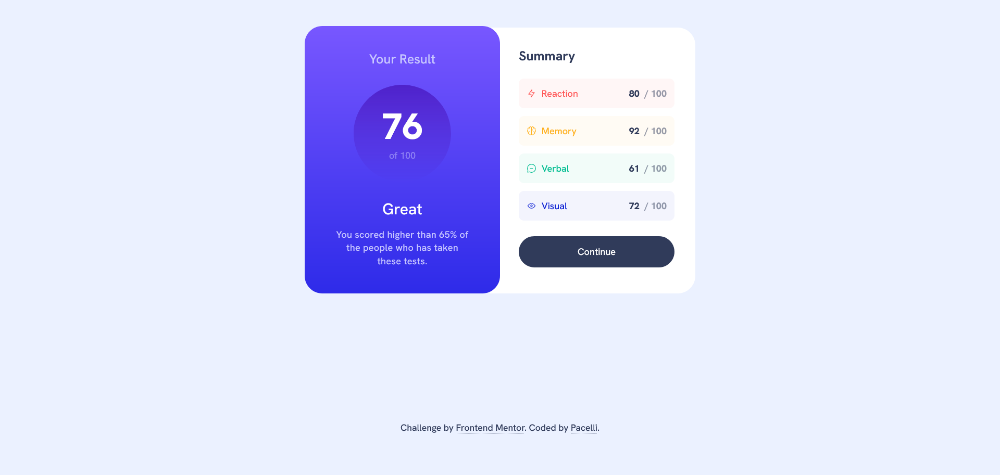

# Frontend Mentor - Results summary component

This is a solution to the [Results summary component challenge on Frontend Mentor](https://www.frontendmentor.io/challenges/results-summary-component-CE_K6s0maV). Frontend Mentor challenges help you improve your coding skills by building realistic projects.

## Table of contents

- [Getting Started](#getting-started)
- [Overview](#overview)
    - [The challenge](#the-challenge)
    - [Screenshot](#screenshot)
    - [Links](#links)
- [My process](#my-process)
    - [Built with](#built-with)
    - [What I learned](#what-i-learned)
    - [Useful resources](#useful-resources)
- [Author](#author)
- [License](#license)

## Getting started

Clone the repo and install the dependencies:

```bash
git clone git@github.com:pacelli3/frontend-mentor-challenges.git
cd frontend-mentor-challenges/results-summary-component
npm install
```

Start Vite's dev server:

```bash
npm run dev
```

This project uses Prettier for code formatting:

```bash
npm run prettier:fix # Format files
npm run prettier:check # List unformatted files
```

## Overview

### The challenge

Users should be able to:

- View the optimal layout for the interface depending on their device's screen size
- See hover and focus states for all interactive elements on the page
- **Bonus**: Use the local JSON data to dynamically populate the content

### Screenshot



### Links

- Solution URL: [Check]()
- Live Site URL: [Check]()

## My process

### Built with

- Semantic HTML5 markup
- CSS custom properties
- CSS utility classes
- Flexbox
- CSS Grid
- BEM - naming methodology for class names
- Vite - To build and develop the project
- TypeScript
- PerfectPixel by WellDoneCode (pixel perfect) - useful for those who don't have figma files

### What I learned

#### `:focus` and `:focus-visible`

For this challenge I took a deep dive into these pseudo-classes.

Originally, user-agents (e.g. browser) applied CSS style based solely on the `:focus` pseudo-class in the form of a ring outline to the element. This ring can be consider ugly or confusing and developers used to remove it, but this can make a site keyboard navigation inacessible for sighted users.

`:focus-visible` was introduced as a way to let user-agents decide, via heuristics, if it's necessary to show the ring to the users. `:focus-visible` matches the focused element **only when needed**. If an user navigates with a mouse to interact with a button, then the browser won't change the appearance of the button, but if the same user uses tabs to navigate to the button, then the appearance will change.

#### BEM

After completing a few challenges on Frontend Mentor I started to realize that I was struggling to come up with unique names for my CSS classes that were meaningful, informative and clearly associated with each other.

BEM, meaning block, element, modifier, is a frontend naming methodology that provides a clear, robust and strict pattern to create CSS classes. The goal of BEM is to let CSS classes to speak for the application &mdash; by reading the names we can transmit the purpose and state of the elements.

The naming convention follows this pattern:

```text
.block
.block__element
.block__element--modifier
```

- `.block` represents a standalone element that makes sense by itself, e.g. `<form>`, `<section>`, `<main>`
- `.block__element` represents a a descendand of `.block` that does not makes sense it self; the parent is needed to derive context, e,g, `<button>`, `<input>`, `<li>`
- `.block__element--modifier` represents a different state of `.block__element`. A modifier can also be applied to a `.block`

Imaging we need to build a traffic light with HTML and CSS, and we start with the following markup:

```html
<div class="housing">
    <div class="bulb red"></div>
    <div class="bulb yellow"></div>
    <div class="bulb green"></div>
</div>
```

The top-level block is a `housing`, which contains the bulbs, that is `.bulb`. A bulb has variations, such as red, yellow or green.

Written in CSS looks like this:

```css
.housing {}
.bulb {}
.red {}
.yellow {}
.green {}
```

I don't think these classes are hard to read, but they are somewhat disconnected, it's not so easy to understand what a `.bulb` is. By using BEM we can enhance the description of the classes and make them more explicit:

```html
<div class="housing">
    <div class="housing__bulb housing__bulb--red"></div>
    <div class="housing__bulb housing__bulb--yellow"></div>
    <div class="housing__bulb housing__bulb--green"></div>
</div>
```

With BEM class names can become quite verbose, but I don't think that's important considering the benefits.

#### Semantic HTML

For me Semantic HTML has seems a perennial source of debate and analysis. It took me some time to choose between a `<dl>` or a `<ul>` for the summary of scores.

Let me briefly explain both elements:

- A `<dl>` represents a association list to group key-value pairs that consist of terms and definitions (a dictionary), metadata topics and values, questions and answers, or any other groups of name-value data, and the order of the list is important

- A `<ul>` a list of items, where the order of the items is not important

The summary of scores is just a form of tabulated data and not a series of key-value pairs, and for this reason I chose the `<ul>`.

### Useful resources

I used the following resources to dive deeper into certain HTML elements to understand their usage and capabilities:

- [`:focus-visible` CSS pseudo-class](https://developer.mozilla.org/en-US/docs/Web/CSS/Reference/Selectors/:focus-visible)
- [The `<ul>` element](https://html.spec.whatwg.org/multipage/grouping-content.html#the-ul-element)
- [The `<dl>` element](https://html.spec.whatwg.org/multipage/grouping-content.html#the-dl-element)
- [BEM](https://getbem.com/)
- [Prettier](https://prettier.io/docs/)
- [Vite](https://vite.dev/)
- [TypeScript](https://www.typescriptlang.org/)
- [Non-null assertion operator](https://www.typescriptlang.org/docs/handbook/release-notes/typescript-2-0.html#non-null-assertion-operator)
- [PerfectPixel by WellDoneCode (pixel perfect)](https://www.welldonecode.com/perfectpixel/)

## Author

- Frontend Mentor - [@pacelli3](https://www.frontendmentor.io/profile/pacelli3)

## License

This project is licensed under the [MIT License](../LICENSE).
