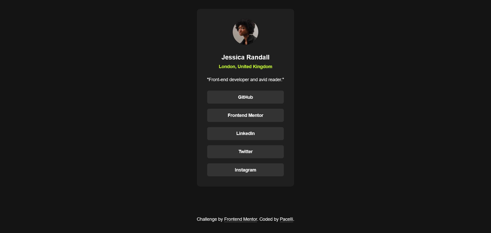

# Frontend Mentor - Social links profile solution

This is a solution to the [Social links profile challenge on Frontend Mentor](https://www.frontendmentor.io/challenges/social-links-profile-UG32l9m6dQ). Frontend Mentor challenges help you improve your coding skills by building realistic projects.

## Table of contents

- [Getting Started](#getting-started)
- [Overview](#overview)
    - [The challenge](#the-challenge)
    - [Screenshot](#screenshot)
    - [Links](#links)
- [My process](#my-process)
    - [Built with](#built-with)
    - [What I learned](#what-i-learned)
    - [Useful resources](#useful-resources)
- [Author](#author)
- [License](#license)

## Getting started

Clone the repo and install the dependencies:

```bash
git clone git@github.com:pacelli3/frontend-mentor-challenges.git
cd frontend-mentor-challenges/social-link-profile
npm install
```

Start Vite's dev server:

```bash
npm run dev
```

This project uses [Prettier](https://prettier.io/docs/) for code formatting:

```bash
npm run prettier:fix # Format files
npm run prettier:check # List unformatted files
```

## Overview

### The challenge

Users should be able to:

- See the responsiveness of the card when the screen size increases or reduces
- The hover state on the links when hovered over &mdash; the color and backound color change

### Screenshot



### Links

- Solution URL: [Check](https://www.frontendmentor.io/solutions/responsive-social-links-profile-with-html-and-css-wCcKdFgESG)
- Live Site URL: [Check](https://social-links-profile-pacelli3.netlify.app/)

## My process

### Built with

- Semantic HTML5 markup
- CSS custom properties
- Flexbox
- CSS Grid
- [Vite](https://vite.dev/) - To build and develop the project

### What I learned

This was a small and simple project consisting of a card for a list of links, the most _complex_ or interesting part of this challenges was to select the appropiate HTML tags for the container, author information and list of links.

For the container I used an `<article>` for the following reasons:

- The card is a self-contained element that makes sense on its own (we don't need the context of the site to understand it)
- Given their self-contained nature, components like this card can be independently distributed or reused (e.g. syndication)

```html
<article>
    <!-- card content -->
</article>
```

A <`section>` and a `<div>` won't work because they are not the appropiate elements to convey the meaning or purpose of the card. The former is an element to divide or group the content of a page into multiple areas, and the latter should be used to group element elements to facilite styling.

I used a `<figure>` as the container for the avatar and for user information, because these elements are related. For the user information a used a `<figcaption>` to create a semantic link for the avatar to provide context.

```html
<figure>
    <!-- Avatar -->

    <figcaption>
        <!-- Author information -->
    </figcaption>
</figure>
```

For the avatar, title, address and description I used ``, `<h1>`, `<address>` and `<p>`, respectively.

The `<address>` element can contain different type of contact information about the user, such as a physical address, URL, email, phone, etc.

For the description I considered to use a `<q>` element due to the quotes, but I don't think it's a quotation, but rather is just a description about the user.

```html


<figcaption>
    <h1>title</h1>
    <address>address</address>
    <p>description</p>
</figcaption>
```

For the links list I created a navigation landmark (`<nav>`) with an unordered list (`<ul>`) and each list item (`<li>`) contained an anchored tag (`<a>`) with the link to the respective profile.

```html
<nav>
    <ul>
        <li><a href="to">site</a></li>
        <li><a href="to">site</a></li>
        <li><a href="to">site</a></li>
        <li><a href="to">site</a></li>
        <li><a href="to">site</a></li>
    </ul>
</nav>
```

#### Syndication

To fully understand the _power_ or use-case of the `<article>` element I need to briefly talk about web syndication.

Web syndication is a marketing strategy where content is distributed or re-published by other sites to (a) increase the traffic and SEO _ranking_ from content-producing sites that does not have a large audience, and (b) for large content providers to publish new content to drive engagement up. With syndication, the social links profile card can be rendered in multiple sites as a form to show gratitude to authors for using their content.

Content-providers (e.g large news outlets) does not have the resources to produce in-depth content about every possible topic and for that reason they rely on small apps (e.g small media outlets, solo authors) to obtain new content.

### Useful resources

- [Understanding Web Syndication: A Guide to How It Works](https://www.investopedia.com/terms/w/web-syndication.asp) - This helped me understand how content in an `<article>` can be _syndicated_.
- [`<article>` HTML article contents element](https://developer.mozilla.org/en-US/docs/Web/HTML/Reference/Elements/article) - Technical reference of this element.
- [`<address>` HTML contact address element](https://developer.mozilla.org/en-US/docs/Web/HTML/Reference/Elements/address) - Technical reference of this element.

## Author

- Frontend Mentor - [@pacelli3](https://www.frontendmentor.io/profile/pacelli3)

## License

This project is licensed under the [MIT License](../LICENSE).
