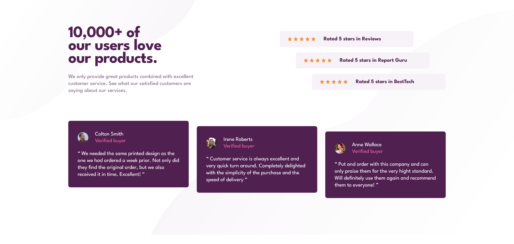

# Frontend Mentor - Social proof section solution

This is a solution to the [Social proof section challenge on Frontend Mentor](https://www.frontendmentor.io/challenges/social-proof-section-6e0qTv_bA). Frontend Mentor challenges help you improve your coding skills by building realistic projects.

## Table of contents

- [Getting Started](#getting-started)
- [Overview](#overview)
    - [The challenge](#the-challenge)
    - [Screenshot](#screenshot)
    - [Links](#links)
- [My process](#my-process)
    - [Built with](#built-with)
    - [What I learned](#what-i-learned)
    - [Continued development](#continued-development)
    - [Useful resources](#useful-resources)
- [Author](#author)
- [License](#license)

## Getting started

Clone the repo and install the dependencies:

```bash
git clone git@github.com:pacelli3/frontend-mentor-challenges.git
cd frontend-mentor-challenges/social-proof-section
npm install
```

Start Vite's dev server:

```bash
npm run dev
```

This project uses Prettier for code formatting:

```bash
npm run prettier:fix # Format files
npm run prettier:check # List unformatted files
```

## Overview

## The challenge

Your challenge is to build out this social proof section and get it looking as close to the design as possible.

You can use any tools you like to help you complete the challenge. So if you've got something you'd like to practice, feel free to give it a go.

Your users should be able to:

- View the optimal layout for the section depending on their device's screen size

### Screenshot



### Links

- Solution URL: [Check]()
- Live Site URL: [Check]()

## My process

### Built with

- Semantic HTML5 markup
- CSS custom properties
- CSS utility classes
- Flexbox
- CSS Grid
- BEM - naming methodology for class names
- Vite - To build and develop the project
- PerfectPixel by WellDoneCode (pixel perfect) - useful for those who don't have figma files

### What I learned

#### `background-image` with multiple images

In this project I saw that we needed to use two images for the `background-image` property which threw me off at the beginning, because so far I've only used 1 always. I learned that is quite easy to use multiple images by comma separating calls to the `url` function. It's also possible to manipulate other properties for each image.

```css
background-image: url("path_to_image1"), url("path_to_image2)";
background-repeat: not-repeat, no-repeat;
background-size: cover, cover;
background-position: left top, right bottom;
```

#### `clamp`

`clamp` is a powerful CSS function to clamp a value within a defined lower bound and a upper bound values. This function takes three parameters: a minimum value, a preferred value and a maximum value.

This is how `clamp(MIN, PREFERRED, MAX)` works:

- Returns `MIN`, if `PREFERRED` is less than `MIN`
- Returns `MAX`, if `PREFERRED` is greater than `MAX`
- Returns `PREFERRED`, if it falls between `MIN` and `MAX`

This function enables a more powerful responsive design, where changes in font size, padding, dimension are smoothed instead of a hard jump from a fixed value to another.

#### `<ul>` for sequence of similar content

Using an unordered list to render a list of elements that are a sequence of similar markup can help screen readers to make sense of them as a group. Just using a landmark element, e.g. `<section>`, `<main>` with `<div>`, will be seem as a soup of blocks by the screen readers.

### Continued development

I want to implement the `clamp` function in others CSS rules to enhance the responsivenes of the landing page, specially, for the _stairs layout_ in the reviews and testimonials sections.

### Useful resources

I used the following resources to help me with this design:

- [BEM](https://getbem.com/)
- [Prettier](https://prettier.io/docs/)
- [Vite](https://vite.dev/)
- [PerfectPixel by WellDoneCode (pixel perfect)](https://www.welldonecode.com/perfectpixel/)
- [`clamp()` CSS function](https://developer.mozilla.org/en-US/docs/Web/CSS/Reference/Values/clamp)
- [Benefits of unordered lists](https://www.w3.org/QA/Tips/unordered-lists#:~:text=Benefits%20of%20Using%20Unordered%20Lists)

## Author

- Frontend Mentor - [@pacelli3](https://www.frontendmentor.io/profile/pacelli3)

## License

This project is licensed under the [MIT License](../LICENSE).
