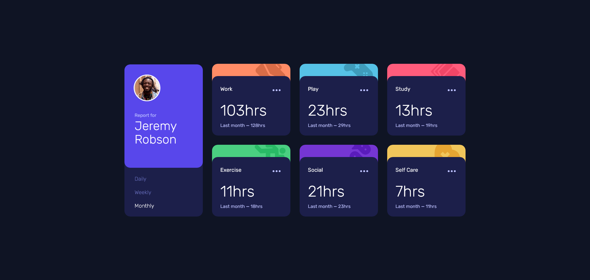
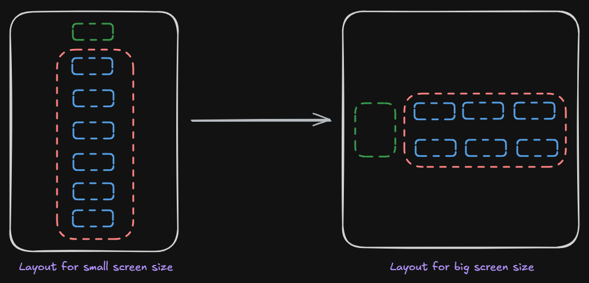
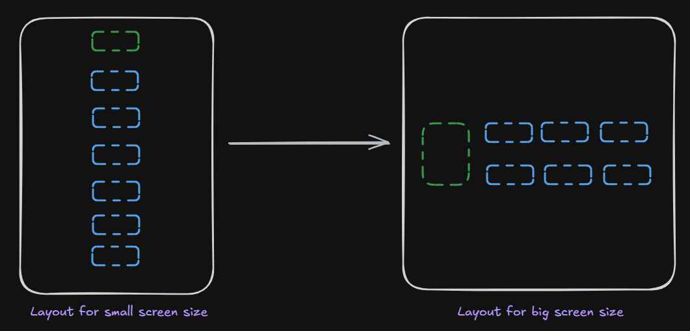

# Frontend Mentor - Time tracking dashboard solution

This is a solution to the [Time tracking dashboard challenge on Frontend Mentor](https://www.frontendmentor.io/challenges/time-tracking-dashboard-UIQ7167Jw). Frontend Mentor challenges help you improve your coding skills by building realistic projects.

## Table of contents

- [Getting Started](#getting-started)
- [Overview](#overview)
    - [The challenge](#the-challenge)
    - [Screenshot](#screenshot)
    - [Links](#links)
- [My process](#my-process)
    - [Built with](#built-with)
    - [What I learned](#what-i-learned)
    - [Continued development](#continued-development)
    - [Useful resources](#useful-resources)
- [Author](#author)
- [License](#license)

## Getting started

Clone the repo and install the dependencies:

```bash
git clone git@github.com:pacelli3/frontend-mentor-challenges.git
cd frontend-mentor-challenges/time-tracking-dashboard
npm install
```

Start Vite's dev server:

```bash
npm run dev
```

Build the project and serve locally:

```bash
npm run build
npm run preview
```

This project uses Prettier for code formatting:

```bash
npm run prettier:fix # Format files
npm run prettier:check # List unformatted files
```

## Overview

## The challenge

Your challenge is to build out this dashboard and get it looking as close to the design as possible.

You can use any tools you like to help you complete the challenge. So if you've got something you'd like to practice, feel free to give it a go.

If you would like to practice working with JSON data, we provide a local `data.json` file for the activities. This means you'll be able to pull the data from there instead of using the content in the `.html` file.

Your users should be able to:

- View the optimal layout for the site depending on their device's screen size
- See hover states for all interactive elements on the page
- Switch between viewing Daily, Weekly, and Monthly stats

### Screenshot



### Links

- Solution URL: [Check]()
- Live Site URL: [Check]()

## My process

### Built with

- Semantic HTML5 markup
- CSS custom properties
- CSS utility classes
- Flexbox
- CSS Grid
- BEM - naming methodology for class names
- Vite - To build and develop the project
- PerfectPixel by WellDoneCode (pixel perfect) - useful for those who don't have figma files
- NVDA - powerful screen reader
- Netlify CLI

### What I learned

#### `display: contents`

The layout of the app goes from 1 to multiple columns from small to big screen size. The app consists in 7 cards: one acts as an introductory cards containing user information and the rest of the cards contain information activities.

To make the app semantically correct, I decided to use a `<header>` element for the introductory card with a navigation and for the rest of the cards I grouped them in a `<ul>` element where each card is a list item.

At the beginning, I considered the option of including the introductory cards as another list item, this could've simplified the layout by having a single grid container. But I dropped this idea after reaching the conclusion that this card is unique, due to its content and the purpose.

<p align="center">
    
</p>

In the screenshot we can see that we have a main container (white) with **two** children: `<header>` (green) and `<ul>` (pink).

To make the app to switch from 1 column to 4, we can set `display: grid` on both main container and the list and control their width, this approach may not be difficult considering we only to manipulate 2 columns as most, but CSS offers a simpler approach by setting `display: contents` on the list to flatten it out to have 1 container.

Setting `display: contents` on a container, causes the element's children to appear as if they are children of the element's parent, by ignoring the element.

<p align="center">
    
</p>

From the screenshot we can see that the `<ul>` (pink) _disappear_ and its children are acting as children of the main container. Now is trivial to apply `display: grid` on the main container to control the layout of the 7 cards.

Using `display: contents` it's too tempting because it can greatly simplify layout manipulation, but this method can greatly affect built-in semantics of an element and for this reason is better to use `display: contents` on non-semantic elements like the `<div>`, therefore for this app is better to handle the layout as two columns with `display: grid`.

#### Single-page applications (SPA) vs Multi-page applications (MPA)

In a Single-page application, the browser makes a single request to the server for the website and when the user navigates to a different route the content is dynamically replaced with new content. In a Multi-page application, on the other hand, the browser request each page from the server to enable routing. To choose between one design on the other, many factors need to be taken into consideration and both approaches have their pros and cons.

I decided to make the dashboard into a MPA for the following reasons:

1. I wanted to learn about setting up a MPA application in Vite
2. Typically, real dashboards are MPAs to improve performance and reduce the cognitive load to understand it

The routes of the app are:

- `/`: home page, renders `index.html` with the daily report
- `/weekly`: weekly page, renders `src/pages/weekly.html` with the weekly report
- `/monthly`: monthly page, renders `src/pages/monthly.html` with the monthly report

Vite supports Multi-page application out of the box: is maps URLs according to the directory structure.

Imaging we have this structure:

```text
.
├── index.html
└── src
    └── pages
        ├── weekly.html
        └── monthly.html
```

To navigate to the `weekly.html` we can type in the search bar `http://localhost:5173/src/pages/weekly.hml`, and the page will be rendered.

The problem with this is the URL is having `/src/pages/` makes it hard to understand for the end-users. This can be easily fixed by re-organizing the project structure, e.g. putting all the pages at the root, but this may not be desired because developers prefer organizing their code by type or purpose.

To leave the pages at our desired location we want and serve them at the desired routes we need to configure our project for both dev and build modes:

1. For dev mode we need to configure Vite Dev Server by creating a plugin. This plugin will use the `configureServer` hook to define a middlerware to: intercept redirects and according to `req.url` server the target page.
2. For build mode we need to configure the service that will serve the `dist` folder: our own server or the hosting service (Netlify, GitHub Pages, Vercel, etc.)

This project is deployed on Netlify, to configure the redirects all we need to do is save a `_redirects` file, without extension, to the publish directory of the site, using the `_redirects` file syntax. In Netlify the Publish directory is the directory that contains the deploy-ready HTML files and assets generated by the build. The directory is relative to the base directory, which is root by default (/), in other words, we need to save the `_redirects` file to the `public` directory.

Example:

```text
# Redirects from what the browser requests to what we serve

/weekly    /src/pages/weekly.html    200
/monthly   /src/pages/monthly.html   200
```

### Continued development

1. Add a 404 page
2. Add functionality to the app: filtering, deleting and adding new cards
3. Add support for dark/light mode
4. Find a way to reduce of images in Markdown without using the `` element

### Useful resources

I used the following resources to help me with this design:

- [NVDA](https://www.nvaccess.org/)
- [BEM](https://getbem.com/)
- [Prettier](https://prettier.io/docs/)
- [Vite](https://vite.dev/)
- [PerfectPixel by WellDoneCode (pixel perfect)](https://www.welldonecode.com/perfectpixel/)
- [Single-Page Applications vs Multi-Page Applications: Choosing the Perfect Web App Architecture](https://madappgang.com/blog/single-page-applications-vs-multi-page-applications/)
- [CSS display: contents](https://caniuse.com/css-display-contents)
- [Get started with Netlify CLI](https://docs.netlify.com/api-and-cli-guides/cli-guides/get-started-with-cli/)
- [Vite Multi-Page App](https://vite.dev/guide/build#multi-page-app)
- [Netlify File-based configuration](https://docs.netlify.com/build/configure-builds/file-based-configuration/)
- [`display: contents` considered harmful](https://ericwbailey.design/published/display-contents-considered-harmful/)
- [Netlify: Redirects and rewrites](https://docs.netlify.com/manage/routing/redirects/overview/)

## Author

- Frontend Mentor - [@pacelli3](https://www.frontendmentor.io/profile/pacelli3)

## License

This project is licensed under the [MIT License](../LICENSE).
